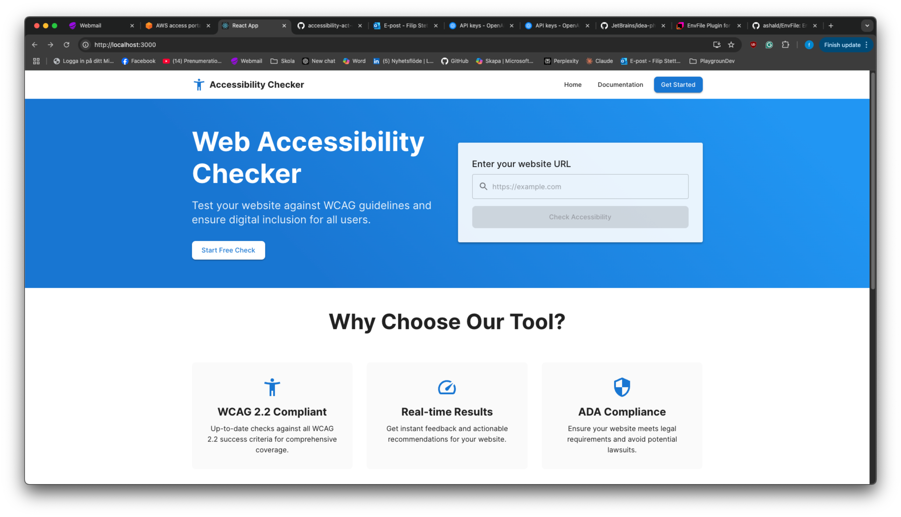
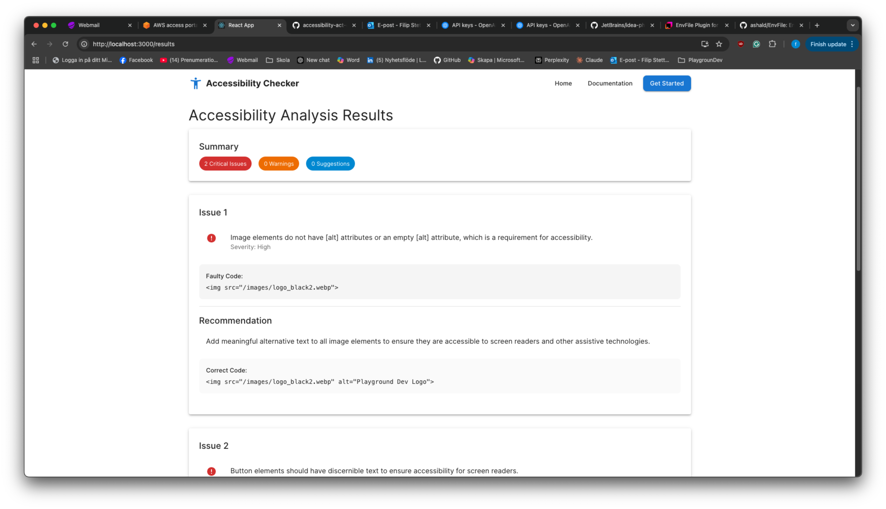

# Accessibility Act Checker

Accessibility Act Checker is a Spring Boot application designed to analyze HTML content for web accessibility issues based on WCAG 2.1 and EN 301 549 standards. Using OpenAI’s GPT-4o model, it provides detailed feedback — including issue descriptions, severity ratings, problematic code snippets, corrected code examples, and recommendations.


## How It Works

The Accessibility Act Checker integrates Selenium and OpenAI to provide a comprehensive analysis of web accessibility:

- **URL Detection & HTML Fetching:**  
  When you input a URL into the application, it first checks if the provided content is a valid URL. If it is, the application uses a Selenium-powered service to launch a headless Chrome browser and fetch the HTML content from that URL.

- **Accessibility Analysis via OpenAI:**  
  Once the HTML content is retrieved (either directly provided by the user or fetched via Selenium), it is sent to the OpenAI API using the GPT-4o model. The API analyzes the HTML against WCAG 2.1 and EN 301 549 standards and returns a detailed JSON response. This response includes:
    - Issue descriptions
    - Severity ratings
    - Faulty code snippets
    - Corrected code examples
    - Recommendations

- **Report Generation:**  
  The JSON response from OpenAI is parsed into an `AccessibilityReport` object. This report is then used by the frontend to display the results in a user-friendly format, showing the list of accessibility issues and actionable recommendations.

This seamless integration of Selenium for content fetching and OpenAI for analysis ensures that both raw HTML and live website URLs are thoroughly evaluated for accessibility compliance.

---

### Home Page


### Accessibility Report


---

## Setup

### Frontend Setup

The project includes a React-based frontend that allows you to interact with the accessibility checker via a user-friendly interface.

1.
 ```bash
 cd frontend
 npm install
 ```
2.
 ```bash
 npm start
 ```
### Backend Setup
-  Use the following command to run the Spring Boot backend:
    ```bash
    ./gradlew bootRun
    ```
